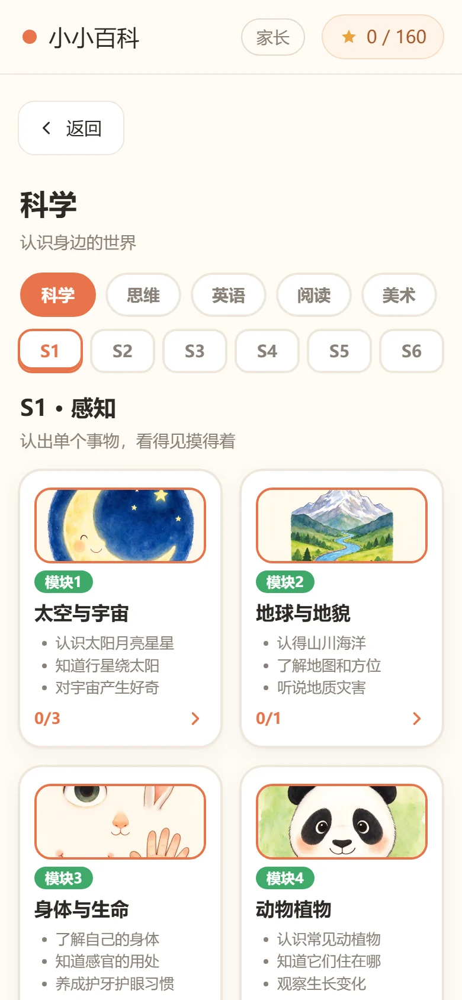
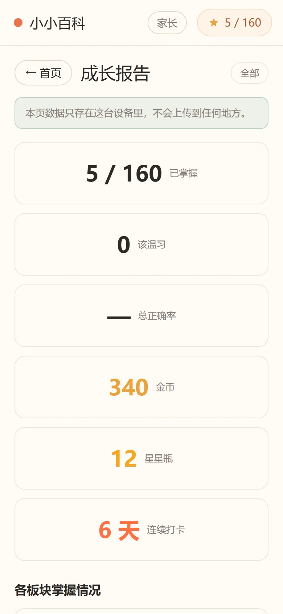

# 小小百科 · kids-app

给 **3–8 岁**孩子的**离线**早教应用。7 个板块、160 个知识点，每个知识点配 3 张水彩手绘绘本页 + 语音朗读 + 一道互动题；另有五阶段探究课、学习证据卡、成长地图与家长端。

原生 ES Module，**零构建、零运行时依赖**。既能当网页跑，也能打成 Android APK。

<p align="center">
  
  
  
  
  
</p>

> 介绍页在 [`site/index.html`](site/index.html)（GitHub Pages 源目录）。

---

## 快速开始

```bash
git clone <本仓库>
cd kids-app
npm run start          # = python -m http.server 8765
# 浏览器打开 http://127.0.0.1:8765
```

不需要 `npm install` —— `package.json` 里没有任何运行时依赖，构建工具也全是 `node:` 内置模块。（`npm install` 只为打包 APK 时装的 Capacitor，见下文。）

> **必须走 http 服务**。原生 ESM 在 `file://` 下会被 CORS 拦，双击打开只会看到白屏。

---

## 它长什么样

| | |
|---|---|
| **7 个板块** | 科学 / 思维 / 英语 / 阅读 / 美术 / 写字 / 音乐 |
| **9 个领域** | 生活科普、地理军事、逻辑思维、空间思维、英语、人文科技、美术、写字、音乐 |
| **160 个知识点** | 每个 3 条事实 + 3 张绘本页 + 1 张封面 + 1 道题 |
| **六级台阶 S1–S6** | 感知 → 辨认 → 关联 → 理解 → 推理 → 迁移 |
| **1127 张插画** | 绘本内页 480 + 封面与图标 647，全部水彩手绘风 |
| **807 段音频** | 旁白 640 + 题目 146 + 单词 13 + 语音 8 |
| **268 条单元测试** | 六道质量闸门全绿 |

### 内容体系

一个知识点落在「板块 → 模块 → S 级」三个坐标上，`src/data/curriculum.js` 是唯一的落位表。

| 板块 | 领域 | 知识点 | 一句话 |
|---|---|---|---|
| 科学 | 生活科普 + 地理军事 | 48 | 认识身边的世界 |
| 思维 | 逻辑思维 + 空间思维 | 44 | 找规律，想明白 |
| 英语 | 英语 | 26 | 学会另一种说法 |
| 阅读 | 人文科技 | 23 | 读懂一个故事 |
| 美术 | 美术 | 6 | 把想法画出来 |
| 写字 | 写字 | 6 | 一笔一划写清楚 |
| 音乐 | 音乐（+ 乐器） | 7 | 听见节奏和旋律 |

**S1–S6 的判据是「一级加一个认知动作」**——每往上一级，孩子要多做一件事。这样定级的好处是可验证：说得出「这个知识点比那个多做了什么」，就说得出它该在哪级。不能是「感觉这个该放 S3」。

| 级别 | 名称 | 判据 | 数量 |
|---|---|---|---|
| S1 | 感知 | 认出单个事物，看得见摸得着 | 31 |
| S2 | 辨认 | 在两者之间比较、配对、归类 | 39 |
| S3 | 关联 | 讲出一件事怎么引起另一件事 | 32 |
| S4 | 理解 | 想一步，说出背后的简单原理 | 25 |
| S5 | 推理 | 多步推理，或处理看不见的东西 | 20 |
| S6 | 迁移 | 跨领域综合，需要背景知识 | 13 |

> 上表由 `npm run validate` 每次输出，不用手工维护。

---

## 常用命令

| 命令 | 作用 |
|---|---|
| `npm run start` | 起本地服务（8765） |
| `npm run validate` | 内容校验：结构、id 唯一性、题型合法性、答案越界、插画引用、课程矩阵落位 |
| `npm run test` | 单元测试（268 条） |
| `npm run check` | `validate && test` —— **提交前必跑** |
| `npm run check:all` | 六道闸门全跑，见下 |

### 六道质量闸门

`npm run check:all` 依次跑六件事，任何一道红就停：

| # | 闸门 | 查什么 | 当前值 |
|---|---|---|---|
| 1 | `validate` | 内容契约：结构、id 唯一、题型合法、答案不越界、插画可达、课程树落位 | 160 / 160 |
| 2 | `test` | 单元测试（`node --test`，无框架依赖） | 268 / 268 |
| 3 | `check:reach` | 死代码 + `sw.js` 覆盖：磁盘上有没人 import、登记了磁盘上没有 | 47 / 47，死代码 0 |
| 4 | `check:media` | 媒体完整性：每个知识点的旁白 / 题音 / 绘本图是否齐全 | 640 / 480 全齐 |
| 5 | `check:art` | 插画质量：格式与扩展名相符、分辨率 ≥1024、三页互不相同、封面不复用内页 | 1127 / 1127 |
| 6 | `check:style` | 画风统一：被代码引用的图必须都是 v5 水彩风 | 旧风 0 |

`check` 只跑前两道（快，够日常用）；`check:all` 是发版前的完整闸。

> **第 6 道闸的判据是 `mtime`，是弱代理** —— 旧内容重写一遍就能拿到新 `mtime`。它只扫 `src/**/*.js` 与 `getArt()` 注册表，不扫 `index.html` / `manifest.webmanifest` / CSS。这道闸防的是「换画风时漏掉几张」，不是内容真实性。

---

## 目录结构

```
kids-app/
├── index.html                 应用外壳（只挂载，不含业务逻辑）
├── manifest.webmanifest       PWA 清单
├── sw.js                      Service Worker，预缓存全部资源
├── package.json               无运行时依赖，只有脚本
│
├── site/                      ★ 介绍页（GitHub Pages 源目录，不属于应用本体）
│   ├── index.html             单文件双语落地页
│   ├── shots/                 6 张应用截图（390×844 @2x，webp）
│   └── icon-*.png
│
├── src/
│   ├── styles.css
│   ├── main.js                装配层：唯一知道谁依赖谁的地方
│   │
│   ├── core/                  基础设施（不认识任何业务概念）
│   │   ├── dom.js             极简元素构建
│   │   ├── store.js           学习进度唯一数据源
│   │   ├── prefs.js           应用偏好（级别档位）—— 与进度分开存
│   │   ├── router.js          hash 路由
│   │   ├── speech.js          语音朗读抽象（换原生 TTS 只改这里）
│   │   └── util.js            纯函数
│   │
│   ├── ui/                    视图层（15 个）
│   │   ├── shell.js           顶栏 + 主容器
│   │   ├── home.js            首页：7 个板块
│   │   ├── section.js         板块页：S1–S6 阶段 tab
│   │   ├── module-map.js      模块学习地图
│   │   ├── topic.js           领域页：知识点列表
│   │   ├── card.js            知识点详情（绘本卡片）
│   │   ├── lesson.js          探究课堂：5 阶段 10 步
│   │   ├── work-card.js       学习证据卡（成就卡）
│   │   ├── works.js           作品墙
│   │   ├── reward.js          星星 / 金币 / 彩带
│   │   ├── map.js             「我的地图」+ 复习机制
│   │   ├── parent.js          家长端：成长报告
│   │   ├── level-bar.js       级别切换条
│   │   ├── book-library.js    绘本库
│   │   └── quiz.js            答题浮层容器
│   │
│   ├── quiz-types/            题型引擎
│   │   ├── index.js           注册表 + 接口契约
│   │   ├── choice.js          三选一
│   │   ├── listen.js          听音选词
│   │   ├── order.js           排序
│   │   ├── match.js           配对
│   │   ├── coloring.js        涂色
│   │   ├── trace.js           描红
│   │   ├── egg.js             砸蛋
│   │   ├── mole.js            打地鼠
│   │   └── branch.js          实验分支
│   │
│   ├── data/                  内容数据
│   │   ├── index.js           注册表 + 查询函数 + 级别过滤
│   │   ├── sections.js        7 个板块
│   │   ├── levels.js          S1–S6 判据与逐点标定
│   │   ├── curriculum.js      板块 × 级别 × 模块 落位表（唯一来源）
│   │   ├── lessons.js         探究课内容
│   │   ├── science.js / geo.js / culture.js / logic.js /
│   │   │   space.js / english.js / art.js / writing.js / music.js
│   │
│   ├── images/                1127 张 webp
│   │   ├── book/              绘本内页 480（160 知识点 × 3 页）
│   │   └── <领域>/            封面与图标
│   │
│   └── audio/                 807 段 mp3
│       ├── narr/              旁白 640
│       ├── quiz/              题目 146
│       ├── word/              单词 13
│       └── voice/             语音 8
│
├── tools/                     校验器与生成器（node: 内置模块 + Python 标准库）
│   ├── validate-content.mjs   内容校验器
│   ├── check-reach.mjs        死代码 + sw 覆盖
│   ├── check-media.mjs        媒体完整性
│   ├── check-art.mjs          插画质量
│   ├── check-style.mjs        画风统一
│   ├── build-www.mjs          生成 www/ 交给 Capacitor
│   ├── fetch-content.mjs      内容事实抓取（GBIF / Open-Meteo / USGS / NASA…）
│   └── make_*.py              图标 / 品牌图生成
│
├── tests/                     17 个 *.test.mjs，268 条
│
├── .preview/                  量测辅助页与开包验脚本（不属于应用）
│
└── docs/
    ├── ARCHITECTURE.md        架构与关键决策的理由
    ├── CONTRIBUTING.md        怎么加知识点 / 领域 / 题型
    ├── CODE-REVIEW.md         审查要点、反模式、本项目特有的坑
    └── ART-STYLE-v5.md        画风规格与素材生成管线
```

---

## 架构：三条不写在文档里的纪律，写在测试里

**1. 分层依赖只准自上而下。** `core` 不认识业务，`ui` 不碰数据字段，`data` 谁都不依赖。`tests/prefs.test.mjs` 直接读源码断言 `core/prefs.js` 不许 `import` 内容数据 —— 靠人记纪律迟早会破，靠断言不会。

**2. 内容与逻辑分离。** 加知识点只改 `src/data/*.js`，逻辑一行不动。校验器不检查「13 小时是不是真的 13 小时」，只检查格式（答案下标越界、art key 不存在、配对题右项重复）。所以带数字的事实要么来自 `npm run fetch` 实测抓取，要么逐条人工核实 —— 科普数字写错了没人看得出来。

**3. 单向数据流。** `store` 是进度的唯一真相源，`prefs` 是偏好的唯一真相源，两者用不同的 localStorage key。混在一起迟早出现「重置进度顺手把级别也清了」这种 bug，`tests/prefs.test.mjs` 里有一条专门守这个。

---

## 打包成 Android APK

### 版本对应关系（选错必失败）

| 组件 | 版本 | 为什么 |
|---|---|---|
| Capacitor | **8.x** | 8.x 对应 `targetSdk 36`，7.x 对应 35 —— 官方不支持自定义 targetSdk |
| JDK | **21** | Capacitor 8 的 Android 工程要 Java 21 |
| Node | **22+** | Capacitor 8 的官方要求，也是 `package.json` 的 `engines` |
| Android SDK Platform | **android-36** | 跟 Capacitor 大版本绑定 |
| Android Build-Tools | **36.0.0** | 与 platform 对齐 |
| Gradle | **8.14.3，用 `bin` 版不要 `all` 版** | `all` 版比 `bin` 版多两万多个文件（源码与 javadoc），构建一个都用不到 |

先查官方矩阵再动手：<https://capacitorjs.com/docs/android/setting-target-sdk>

### 步骤

```bash
npm install            # 只为装 Capacitor（devDependencies）
npm run apk            # 校验 → 测试 → 生成 www/ → cap sync → gradle assembleDebug
```

或拆开跑：

```bash
npm run cap:sync       # 生成 www/ + cap sync android
export JAVA_HOME="/path/to/jdk-21"
export ANDROID_HOME="/path/to/android-sdk"
cd android && ./gradlew assembleDebug
```

产物：`android/app/build/outputs/apk/debug/app-debug.apk`

> **别跳过 `cap copy`。** 只跑 `npm run www` 的话 `www/` 是新的，但 `android/app/src/main/assets/public/` 还是旧的 —— Gradle 看源文件没变会报 `BUILD SUCCESSFUL` 而**一个任务都不执行**，打出来还是上一次的包，且没有任何报错。
>
> 判断口诀：构建日志里出现 `93 actionable tasks: 93 up-to-date` 就是没同步，正常重新打包应该看到 `3 executed, 90 up-to-date`。

### 装到设备

```bash
adb install -r android/app/build/outputs/apk/debug/app-debug.apk
```

### 打包后可能要改的一件事

Android WebView 对 `speechSynthesis` 支持不稳定。如果装成 APK 后没有语音，改用 `@capacitor-community/text-to-speech` 调原生 TTS —— **只需替换 `src/core/speech.js`**，UI 和题型引擎一行不用动。这是当初做这层抽象的原因。

`README` 更早版本里记了一批打包踩坑（Gradle 镜像、`sdkmanager` 解压失败、锁文件被拦等），已随本仓库独立化一并精简；遇到问题请先看 `docs/CODE-REVIEW.md`。

---

## 隐私与合规

- **数据零上传。** 学习进度、星数、金币、作品全部存在本机 `localStorage`，没有任何网络请求。家长端顶部明写「本页数据只存在这台设备里」。
- **APK 只申请一个权限**：`INTERNET`（WebView 需要）。没有麦克风、没有相机、没有定位 —— 录音走 `MediaRecorder`，被拒绝时不报错不拦路，退化成「先对爸爸妈妈讲一讲」；拍照走 `<input type="file" capture>`，不需要原生插件。
- **不使用任何地图轮廓素材。** 手绘国界存在漏绘、错绘、变形风险，一律规避 —— 地理领域改用长城、指南针、山岳这类具体地物承载知识点。如确需使用中国地图，必须使用自然资源部标准地图服务（`bzdt.ch.mnr.gov.cn`）的底图，完整表示中国版图，标注审图号，不得裁切或自行绘制。
- **插画与音频全部原创**，不拷贝任何第三方素材。

---

## 文档

- **[架构说明](docs/ARCHITECTURE.md)** —— 分层、依赖方向、关键决策的理由
- **[贡献指南](docs/CONTRIBUTING.md)** —— 怎么加知识点 / 领域 / 题型，常见错误对照表
- **[Code Review 清单](docs/CODE-REVIEW.md)** —— 审查要点、反模式、本项目特有的坑
- **[画风规格](docs/ART-STYLE-v5.md)** —— 水彩手绘风提示词规则与素材生成管线

---

## 已知限制

1. **语音**在 Android WebView 中支持不稳定，见上文
2. **内容量是入门规模** —— 160 个知识点够孩子玩一阵，但离「百科」还差得远。扩充成本很低（只改 `src/data/*.js`），真正的瓶颈在**内容审校**，不在工程
3. **无家长锁** —— 顶栏「家长」入口目前没有儿童锁
4. **家长端只有成长报告**，没有错题重练
5. **`check:style` 用 `mtime` 当判据**，是弱代理（见上文）
6. **未做真机回归** —— 装机链路跑通，但多机型适配未验证

---

## 许可

本仓库尚未附 `LICENSE` 文件。在补上之前，默认保留全部权利（All rights reserved）—— 如需开源许可，请先明确选哪个（MIT / Apache-2.0 / CC-BY-NC 等；插画与音频若单独授权需另附说明）。
